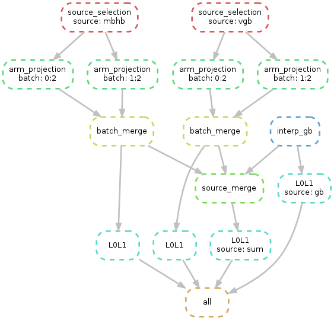

# Running

## Running the test pipeline

- `cd test/runtest `
- `snakemake -j 1`

## Setting a working directory

Choose a location for your pipeline, where all the data products, log
and configuration files will be saved.

- `cd pipeline ` 
- ` runsim --init path/to/your/working/directory`
- ` cd path/to/your/working/directory `
- ` runsim --info` 

The `runsim --info` command gives a summary of the pipeline settings. 

## Ancillary data

GW sources are taken from ancillary catalogs, which need to be downloaded
beforehand.

There are for now 3 catalogs corresponding to the 3 source types
included in the pipeline:

- `../data/VGB.npy` for the 10 verification binaries;
- `../data/Q3d_complete` for the 692 MBHB;
- `Catalog_NoID.npy` for the 30 millions galactic binaries.

The first two can be retrieved from `git-lfs`.  The last one is large
(1.8Gb) and has to be found by other means. The README file of the
`data` subdirectory gives more details about this. 

### Data already on disk

- ` runsim --data /path/to/your/data/directory` will update all source
  configuration files with the provided data path.

### Data already on disk, but running with singularity

In the case where the pipeline is to be run with singularity, one
needs to bind the data location to the singularity container.

- `export SINGULARITY_BINDPATH="/path/to/your/data/directory:/data"`
- `runsim --data /data`

### Data not already on disk

Look at the `data/README.md` file to find instructions to download the
data. 

## Instrumental configuration

The instrumental configuration is given by the `config.yml` file. 

Advanced user can also change the `lisanode` graph and configuration
by editing the `lisanode_config.py` and `LDC_graph` files
respectively.

## GW source configuration

The list of sources included in the simulation is given by the
`sources` parameter on the `config.yml` file. For each of them, a
dedicated parameter file is set and can be adjusted. In particular,
they give the location of the input source catalog and the number of
sources to be included.

The galactic binary sources follow a special handling due to their
very high number. They are built by a dedicated subworkflow, located
in the `gb-pipeline` subdirectory, and therefore are configured
through a dedicated `config.yml` file. In particular, the sampling can
be adjusted to a lower value to increase the computing speed (`dt`
parameter), and the number of batch can be set to get a high level of
parallelization (`nbatch` parameter). This subworkflow is
automatically run by the main one.

## Pipeline configuration

The pipeline is configured through parameters set in the `config.yml`
files:

- `nbatch`: gives the number of projections which can be done
  independantly, it corresponds to the maximum number of parallel jobs
  desired. The actual number of jobs used is set at the command line.
  
- `dirname`: gives the name of the subdirectory in which the data
  product will be saved.
  
The pipeline also uses some extra parameters, one of which sets the
path to external libraries used by LISANode (`ldc_liborbits`). The
default path is the one that should be used when running the pipeline
with singularity.

## Running

We provide a `runsim` script which controls the execution of the
pipeline, on top of `snakemake`: `runsim --help`

Advanced user may want to directly use the `snakemake` commands, which
are numerous: `snakemake --help`

For more documentation, see
[The SnakeMake officiel documentation](https://snakemake.readthedocs.io/en/stable).

**Dry run**

It is useful to systematically check what snakemake will compute
before running. To do so: `snakemake -nr` Snakemake checks the last
date of modification of the files used by all stages (rules) of the
pipeline. If one of the input file has changed, the stage is
(re)processed.

It is sometimes necessary to bypass this rule, by setting manually an
early date for a given file: 

`touch --date='2020-03-01 10:00:00' config.yml`

**Full run**

By default, only the noisy TDI containing all GW sources together is
produced.  In order to also get independant noise free TDI for all GW
source types, run `snakemake full`. 

**Run on a laptop**

` snakemake --cores 2`

Number of workers that can run in parallel is set by the `--cores`
option (or `-j`). 

**Run on a cluster**

 ` snakemake --cores 2 --cluster "qsub -l nodes=1:ppn=1,walltime=96:00:00"`

Job properties are given by the `--cluster` option. A specific amount
of memory is set at the last stage of the pipeline (see l. 116 of
Snakefile). A default amount of memory can be set for the other rules,
by using:

`snakemake --cores 2 --default-resources "mem_mb=10000" --cluster "qsub -l
nodes=1:ppn=1,mem={resources.mem_mb}mb,walltime=96:00:00"`

**Run with singularity**

In your working directory, download the singularity image (see README for instructions)

`snakemake --cores 2 --use-singularity`

## More on the pipeline execution

Log files are systematically produced by snakemake, and saved in the
`log` subdirectory. 

Snakemake can build a report on the run, containing plots of the GW
strain, as well as CPU statistics: `snakemake --report report.html`

A graphical representation of the underlying workflow can be obtained
via: `snakemake --dag | dot -Tpng > dag.png `

 
